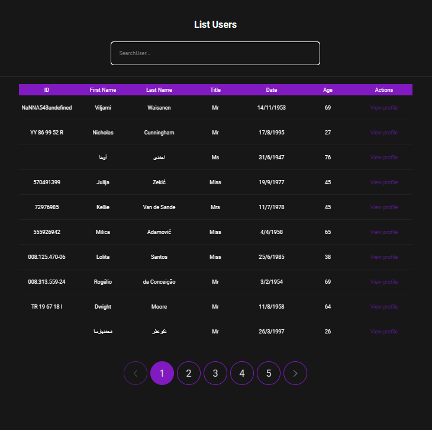

# Users List &nbsp;

<p align="center">
<a href="https://react.dev/" target="_blank"></a>
<a href="https://reactrouter.com/en/main" target="_blank"></a>
<a href="https://www.typescriptlang.org/" target="_blank"></a>
<a href="https://sass-lang.com/" target="_blank"></a>
<a href="https://vitejs.dev/" target="_blank"></a>
<a href="https://vercel.com/" target="_blank"></a>

## Teste intermediário da [Union Developers](https://www.uniondevelopers.com.br/)

Esse é um projeto que lista os usuários e disponibiliza informações detalhadas de cada usuário.

## Tabela de Conteúdos

- [Descrição](#descricao)
- [Funcionalidades](#funcionalidades)
- [Screenshots](#screenshots)
- [Deploy](#deploy)
- [Tecnologias](#tecnologias)
- [Pré-requisitos e como rodar a aplicação](#pre-requisitos-e-como-rodar-a-aplicacao)
- [Agardecimentos](#agradecimentos)

## Descrição

Essa projeto foi desenvolvido em React.js e consiste em uma Single Page Aplication(SPA), com uma página inicial(home) com a listagem de usuários, e uma página interna com os detalhes do usuário selecionado. A listagem de usuários é feita através da [Random Users](https://randomuser.me/).

## Funcionalidades

- A página inicial home possui uma lista de 10 usuários por página.

- A lista de usuários possui paginação.

- A página inicial(home) possui um campo de busca pelo nome do usuário.

- É possível visualizar o perfíl de um usuário especifico

## Screenshots



## Deploy

Link para a página do projeto: [Deploy através da vercel](https://fetch-users-sigma.vercel.app/)

## Tecnologias

- [Vite](https://vitejs.dev/)
Usado por ser uma forma mais moderna e atualizada de criação de projetos react no lugar do padrão CRA(create-react-app)

- [React](https://react.dev/)
Além do objetivo de praticar essa tecnologia, usamos o React.js para termos uma aplicação SPA e pela reausabilidade que se tem quando se trabalha com componentes.

- [TypeScript](https://www.typescriptlang.org/)
Linguagem fortemente tipada construida com base em JavaScript, nos proporcionando maior integração com o nosso editor, assim como também facilitia o entendimento e compartilhamento do código produzido.

- [SASS](https://sass-lang.com/)
Pre-processador poderoso que adiciona "poderes" adicionais ao tradicional CSS, porporcionando funcionalidades e agilidade

- [React-router-dom](https://reactrouter.com/en/main)
Biblioteca escolhida por trabalhar com o conceito de SPA deixando a navegacão entre páginas sem atualização e mais dinamico.


## Pré-requisitos e como rodar a aplicação

:warning: Necessário ter o [Node](https://nodejs.org/en) instalado.

Para rodar a aplicação basta clonar o repositório utilizando a linha de comando
```
https://github.com/viniciusmontibeller/pokedex.git
```
Entre na pasta do projeto
```
cd pokedex
```
Baixe as dependências do projeto usando o gerenciador de pacotes escolhido. npm - yarn - pnpm
```
npm install  
```
Ou de forma abreviada 
```
npm i
```
Como o pojeto foi criado usando o [Vite](https://vitejs.dev/), para rodar a aplicação use
```
npm run dev
```
Pronto agora é possível acessar a aplicação apartir da porta criada Ex: http://localhost:3000/

## Agradecimentos

Preciso dizer que estou muito feliz em estar estudando proramação com as aulas do [Dev em Dobro](https://github.com/devemdobro). Eu comecei com zero habilidades em programação e agora eu consigo ver que estou evoluindo pouco a pouco aonde quero chegar.